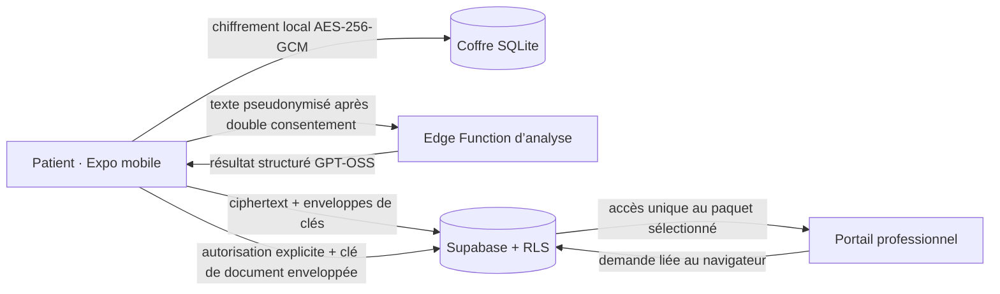

# WérPass

WérPass est un coffre mobile local-first de documents médicaux synthétiques, contrôlé par le patient, présenté à **Impact Forge: Summer 2026 Hackathon** dans la catégorie **General Innovation**.

Le MVP démontre un coffre patient réellement utilisable hors ligne, une analyse consentie avec GPT‑OSS via une fonction serveur et un partage temporaire avec un professionnel de démonstration. Toutes les données utilisées sont synthétiques.

## État

La verticale de démonstration est recentrée sur le consentement patient : inscription par téléphone, PIN local, coffre SQLite local avec chiffrement applicatif AES-256-GCM, synchronisation du ciphertext, QR opaque, demande professionnelle identifiée, puis confirmation ou refus par le patient. Après l’accord, le portail professionnel demandeur ouvre directement l’enveloppe chiffrée, sans second code ni SMS de partage.

L’Edge Function d’analyse utilise `openai/gpt-oss-120b` derrière une API serveur compatible OpenAI ; un repli local déterministe reste disponible et explicitement étiqueté. Le portail professionnel reçoit uniquement le paquet chiffré autorisé.

- Brief source : [Project.txt](Project.txt)
- Périmètre produit recentré : [docs/SCOPE.md](docs/SCOPE.md)
- Architecture : [docs/ARCHITECTURE.md](docs/ARCHITECTURE.md)
- Sécurité : [docs/SECURITY.md](docs/SECURITY.md)
- Contrat hors ligne : [docs/OFFLINE_DEMO.md](docs/OFFLINE_DEMO.md)
- Configuration Supabase, OTP et analyse IA : [docs/CONFIGURATION.md](docs/CONFIGURATION.md)
- Contrats applicatifs : [docs/CONTRACTS.md](docs/CONTRACTS.md)
- Stratégie de tests : [docs/TESTING.md](docs/TESTING.md)
- Démo et soumission : [docs/DEMO.md](docs/DEMO.md)
- Dépannage reproductible : [docs/TROUBLESHOOTING.md](docs/TROUBLESHOOTING.md)

## Ligne directrice

Une seule tranche verticale doit être fiable :

1. importer un document synthétique hors ligne ;
2. le chiffrer et le consulter après redémarrage ;
3. préparer l’import intelligent sans réseau ;
4. afficher et approuver le texte pseudonymisé ;
5. obtenir un résultat structuré de GPT‑OSS, ou utiliser le repli local explicitement simulé ;
6. synchroniser le ciphertext ;
7. générer à la demande un QR et son code numérique temporaire ;
8. laisser le médecin demander l’accès, faire confirmer ou refuser la demande par le patient, puis vérifier l’ouverture directe à usage unique et la révocation.

Le partage distant sans réseau est illustré honnêtement comme une intention en attente de reconnexion. La consultation sur le téléphone du patient fonctionne réellement hors ligne.

## Règles absolues

- Ne jamais utiliser de vraies données médicales.
- Ne jamais envoyer le document original à un fournisseur IA.
- Ne jamais placer de donnée médicale ou de clé dans un QR, un code, un log ou une variable publique.
- Ne jamais confondre OTP d’inscription, PIN local et code QR de partage.
- Ne pas présenter le prototype comme un produit médical certifié.

## Démarrage

Le socle applicatif se vérifie avec :

```text
pnpm verify
```

Cette commande reproduit les vérifications de la CI : lint, types, tests ciblés, scan de sécurité et build du portail. Réinitialiser l’état de démonstration généré par les scripts avec `pnpm demo:reset` ; la base SQLite de l’appareil se réinitialise depuis l’interface avec confirmation explicite.

## Architecture



Les frontières de confiance, contrats et limites du prototype sont détaillés dans [docs/ARCHITECTURE.md](docs/ARCHITECTURE.md), [docs/SECURITY.md](docs/SECURITY.md) et [docs/THREAT_MODEL.md](docs/THREAT_MODEL.md).

Le coffre du Hackathon MVP utilise SQLite standard et peut fonctionner avec Expo Dev Client :

```text
corepack pnpm --filter @werpass/mobile android
```

Dans l’application, saisir un numéro de test au format international, valider l’OTP SMS Supabase et créer un PIN local de quatre chiffres. Tout fichier non vide jusqu’à 5 Mo peut être importé ; seuls `prescription-demo.pdf` et `lab-result-demo.jpg` sont éligibles à l’import intelligent pseudonymisé. L’accueil propose « Générer un code de partage » : le QR et le code numérique n’apparaissent qu’après cette action.

Si Android restaure une ancienne base sans la clé SecureStore correspondante, l’application affiche « Coffre local incompatible ». La réinitialisation proposée supprime uniquement les documents et secrets locaux après confirmation ; elle est irréversible.

### Windows et dossier court `C:\wp`

Le dépôt Git canonique reste `C:\Users\user\Documents\Projects\WerPass`. Le dossier `C:\wp` est seulement un miroir court utilisé pour éviter la limite de longueur CMake et ne contient pas `.git`. Avant de compiler depuis ce miroir :

```powershell
Set-Location C:\Users\user\Documents\Projects\WerPass
.\scripts\sync-windows-mirror.ps1
Set-Location C:\wp
corepack pnpm android
```

Le script ne supprime rien dans le miroir et préserve les fichiers `.env` locaux. Ne modifier qu’une seule source de vérité : le dépôt canonique.

### Configuration de l’analyse GPT‑OSS

Définir `EXPO_PUBLIC_SUPABASE_URL` et `EXPO_PUBLIC_SUPABASE_PUBLISHABLE_KEY` dans l’environnement du development build. La clé du fournisseur d’inférence reste exclusivement dans les secrets de l’Edge Function, jamais dans un fichier `.env` client ni dans une variable `EXPO_PUBLIC_*`. Les noms de variables exacts sont documentés dans [docs/CONFIGURATION.md](docs/CONFIGURATION.md).

Toute clé copiée dans une conversation, un ticket ou un log doit être révoquée avant utilisation.

La procédure complète, incluant migrations, Auth Phone, fonctions serveur et tests manuels, se trouve dans [docs/CONFIGURATION.md](docs/CONFIGURATION.md).

### Partage professionnel de démonstration

Après inscription par téléphone et synchronisation, le patient peut générer :

- un QR sans donnée ni clé ;
- le même identifiant sous forme d’un code numérique de huit chiffres ;
- une expiration de cinq minutes ;
- une action de suppression/révocation.

Le médecin scanne le QR ou saisit le code de partage, puis renseigne son nom et son établissement. La demande apparaît dans l’application du patient, qui peut l’autoriser ou la refuser. Seule l’autorisation ouvre directement le portail ayant créé la demande. Un UUID privé, conservé uniquement dans ce navigateur, est exigé en plus du QR court ; aucun code médical ni SMS de partage n’est généré.

Construire le portail avec `pnpm --filter @werpass/clinician-web build`, puis ouvrir `apps/clinician-web/dist/index.html` via un serveur HTTP statique. Un accès réussi, après accord patient, est unique et affiche uniquement les informations techniques du paquet chiffré sélectionné.

Le backend de partage se déploie avec :

```text
supabase functions deploy share-demo
```

Attention : l’OTP d’inscription est envoyé par le fournisseur configuré dans **Supabase Auth → Phone**. Le partage direct ne dépend pas de Twilio ni d’un second SMS.

## Références techniques

- [Expo documentation](https://docs.expo.dev/)
- [Supabase documentation](https://supabase.com/docs)
- [TweetNaCl.js](https://github.com/dchest/tweetnacl-js)
- [Vite documentation](https://vite.dev/guide/)

## Échéance Impact Forge

La soumission officielle ferme le **16 août 2026 à 23:00 UTC**. Le dépôt public, une vidéo de démonstration de moins de trois minutes et un aperçu technique écrit sont obligatoires.
